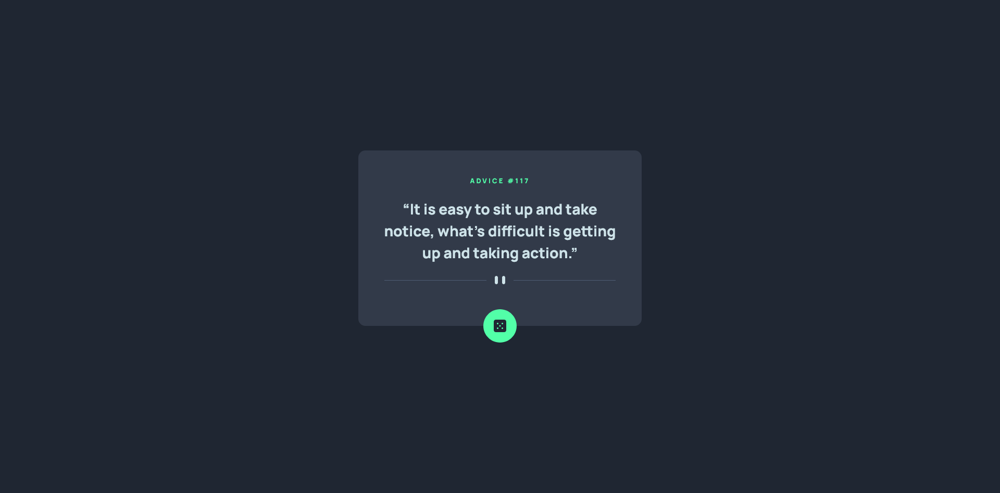

# Frontend Mentor - Advice generator app solution

This is a solution to the [Advice generator app challenge on Frontend Mentor](https://www.frontendmentor.io/challenges/advice-generator-app-QdUG-13db). Frontend Mentor challenges help you improve your coding skills by building realistic projects.

## Table of contents

- [Overview](#overview)
  - [The challenge](#the-challenge)
  - [Screenshot](#screenshot)
  - [Links](#links)
- [My process](#my-process)
  - [Built with](#built-with)
  - [What I learned](#what-i-learned)
  - [Continued development](#continued-development)
  - [Useful resources](#useful-resources)
- [Author](#author)
- [Acknowledgments](#acknowledgments)

## Overview

### The challenge

Users should be able to:

- View the optimal layout for the app depending on their device's screen size
- See hover states for all interactive elements on the page
- Generate a new piece of advice by clicking the dice icon

### Screenshot

### Links

- Solution URL: [GitHub](https://github.com/mbdelarosa/advice-generator-app)
- Live Site URL: [Advice Generator App](https://mbdelarosa.github.io/advice-generator-app)

## My process

### Built with

- Semantic HTML5 markup
- CSS custom properties
- Flexbox
- CSS Grid
- Mobile-first workflow
- Javascript
- [Advice Slip API](https://api.adviceslip.com/)

### What I learned

The main thing I learned from this challenge was how to generate a new advice from the Advice Slip API using `fetch()`, as this is the first time I was able to use it in JS.

### Continued development

- Would like to add a Loading animation after button press
- Have tried to use `clamp` here for the `font-size` property, so I would like to learn more about this and its best practices
- Also added a `transition` for the box shadow on button hover, would like to explore animation and CSS transitions more in the future

### Useful resources

- [Utopia](https://utopia.fyi/) - This helped in generating `clamp` for font sizes
- [An Interactive Guide to CSS Transitions](https://www.joshwcomeau.com/animation/css-transitions/) by Josh Comeau - A good read on CSS transitions, with examples and explanation on implementation and performance
- Helpful docs on the Fetch API:
	- [Using the Fetch API - MDN Web Docs](https://developer.mozilla.org/en-US/docs/Web/API/Fetch_API/Using_Fetch)
	- [JavaScript fetch() Method - GeeksforGeeks](https://www.geeksforgeeks.org/javascript-fetch-method/)

## Author

- Frontend Mentor - [@mbdelarosa](https://www.frontendmentor.io/profile/mbdelarosa)